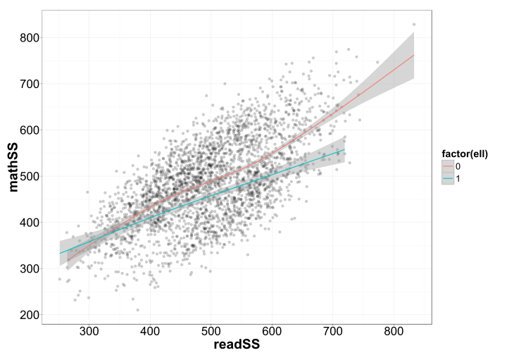
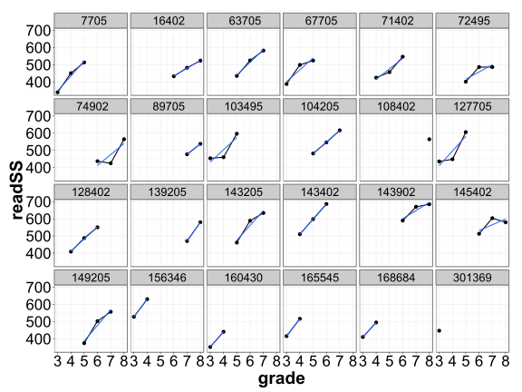
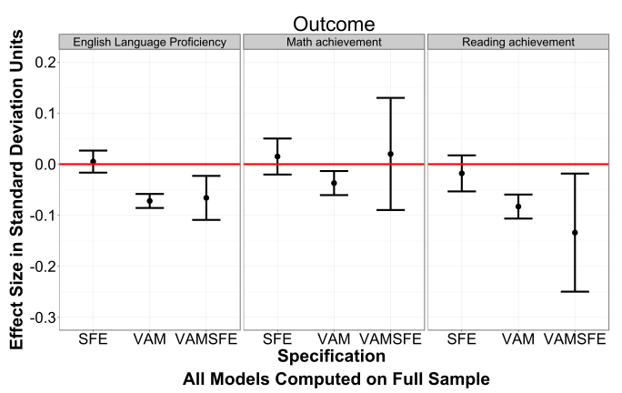
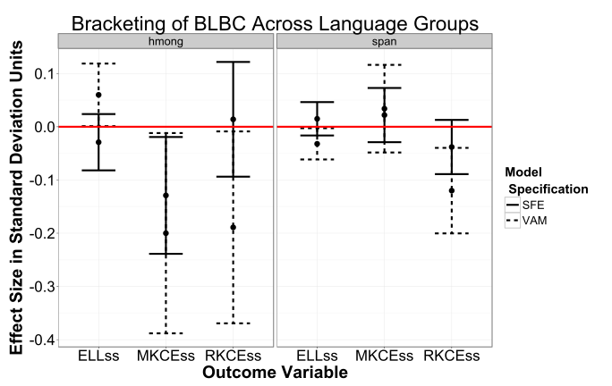
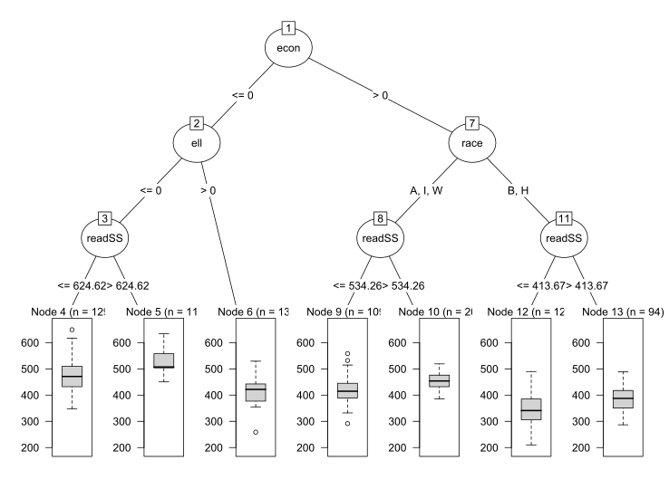
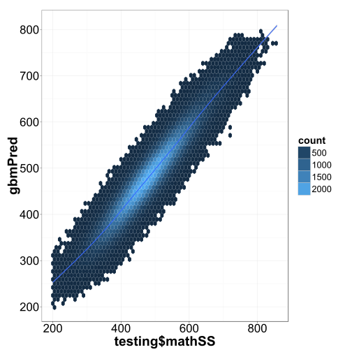
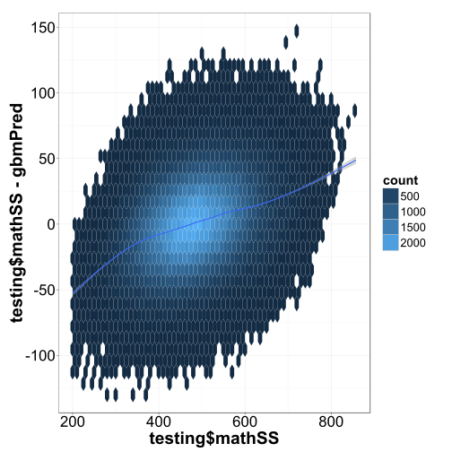
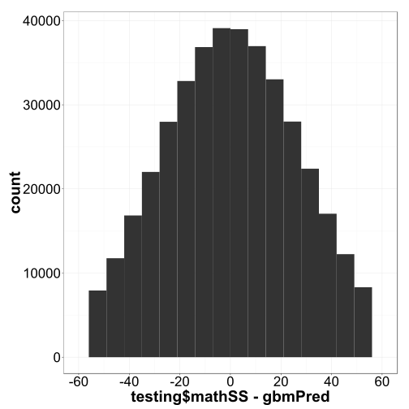
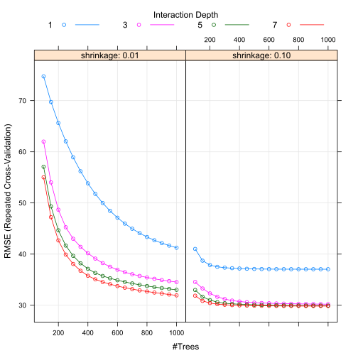

% Using R and Longitudinal Data System Records to Answer Policy Questions
% Jared Knowles


# Overview
- Why R?
- Examples of R Analyses?
- Share R code across states
- Develop joint methods
- Produce reports


# Why R?
- R is free
- R is open source
- R is **best in class** and state of the art
- R is free

# R
<p align="center"></p>

# Google Scholar Hits
R has recently passed Stata on Google Scholar hits and it is catching up to the two major players SPSS and SAS

<p align="center"></p>

# R Has an Active Web Presence
R is linked to from more and more sites 

<p align="center"></p>

# R Extensions
These links come from the explosion of add-on packages to R

<p align="center"></p>

# R Has an Active Community 
Usage of the R listserv for help has really exploded recently

<p align="center"></p>


# R Examples
Read in Data


```r
studat <- read.csv("data/smalldata.csv")
str(studat[5:18, ])
```

```
## 'data.frame':	14 obs. of  32 variables:
##  $ X          : int  274 276 478 574 613 620 717 772 1004 1056 ...
##  $ school     : int  1 1 1 1 1 1 1 1 1 1 ...
##  $ stuid      : int  142705 14995 120205 103495 55705 28495 37705 52705 41995 10705 ...
##  $ grade      : int  3 3 3 3 3 3 3 3 3 3 ...
##  $ schid      : int  205 495 205 495 205 495 205 205 495 205 ...
##  $ dist       : int  75 105 15 45 75 45 75 75 105 75 ...
##  $ white      : int  0 0 0 0 0 0 0 0 0 0 ...
##  $ black      : int  1 1 1 1 1 1 1 1 1 1 ...
##  $ hisp       : int  0 0 0 0 0 0 0 0 0 0 ...
##  $ indian     : int  0 0 0 0 0 0 0 0 0 0 ...
##  $ asian      : int  0 0 0 0 0 0 0 0 0 0 ...
##  $ econ       : int  1 1 1 1 1 0 1 0 1 1 ...
##  $ female     : int  0 0 0 0 0 0 0 0 0 0 ...
##  $ ell        : int  0 0 0 0 0 0 0 0 0 0 ...
##  $ disab      : int  0 0 0 0 0 0 0 0 0 0 ...
##  $ sch_fay    : int  0 0 0 0 0 0 0 0 0 0 ...
##  $ dist_fay   : int  0 0 0 0 0 0 0 0 0 0 ...
##  $ luck       : int  0 0 1 0 0 0 0 1 0 0 ...
##  $ ability    : num  81.9 101.9 87.3 96.6 98.4 ...
##  $ measerr    : num  52.98 22.6 4.67 -9.35 -7.7 ...
##  $ teachq     : num  56.68 71.62 66.88 75.21 4.95 ...
##  $ year       : int  2000 2000 2000 2000 2000 2000 2000 2000 2000 2000 ...
##  $ attday     : int  156 157 169 180 170 152 162 180 152 165 ...
##  $ schoolscore: num  56 56 56 56 56 ...
##  $ district   : int  3 3 3 3 3 3 3 3 3 3 ...
##  $ schoolhigh : int  0 0 0 0 0 0 0 0 0 0 ...
##  $ schoolavg  : int  1 1 1 1 1 1 1 1 1 1 ...
##  $ schoollow  : int  0 0 0 0 0 0 0 0 0 0 ...
##  $ readSS     : num  373 437 418 454 310 ...
##  $ mathSS     : num  441 463 436 434 284 ...
##  $ proflvl    : Factor w/ 4 levels "advanced","basic",..: 2 4 4 4 3 2 4 4 2 3 ...
##  $ race       : Factor w/ 5 levels "A","B","H","I",..: 2 2 2 2 2 2 2 2 2 2 ...
```

```r
source("data/simulate_data.R")
```


# Simple Diagnostics


```r
source("ggplot2themes.R")
library(ggplot2)
qplot(readSS, mathSS, data = studat, alpha = I(0.2)) + geom_smooth(aes(group = ell, 
    color = factor(ell))) + theme_dpi()
```

 


# Advanced Diagnostics


```r
samp <- sample(studat$stuid, 24)
plotsub <- subset(studat, stuid %in% samp)
qplot(grade, readSS, data = plotsub) + facet_wrap(~stuid, nrow = 4, 
    ncol = 6) + theme_dpi() + geom_line() + geom_smooth(method = "lm", se = FALSE)
```

 


# More Advanced 
<p align="center"></p>

# What we do?
- We fit statistical models to all the students in Wisconsin modeling their future test score as best as possible through each strategy described above
- We also include an indicator of whether the student was eligible for BLBC instruction or not
- We compare to see if the average student receiving BLBC did better than the average student receiving other ESL services, all else equal
- We report the range of uncertainty around this difference between student groups and compare them to see if any meaningful differences emerge
- Due to our large sample size we expect our results to be biased in favor of finding statistically significant results, so we also examine the magnitude of findings to see if they are **substantively significant**; i.e. is the difference big enough to matter in the lives of students?


# Evaluations of Policy 
- Results are presented in effect sizes, or standard deviation units of change in test scores.
- **0.1** is small, 0.2 to 0.4 is reasonable and is about a *year* of education in most cases. Bigger than 0.4 is huge.
 

- The bars represent the 95% confidence interval around the estimate. The VAM model is consistently statistically significant, not overlapping 0, and negative.
- The length of the bars represent the uncertainty about the estimate.
- But the mean effect size is quite small, less than 0.1 standard deviations in most cases. 
- This represents a year-to-year change in a student's score between BLBC and non-BLBC instruction.

# Results
- Language is different. Wisconsin has a large sample of both Hmong and Spanish speakers and they have different results when analyzed separately
 

- BLBC has no effect for Spanish speakers on math, but a large negative effect for Hmong speakers
- BLBC may be slightly negative for reading among SPanish speakers, but not for Hmong speakers
- BLBC may be slightly positive for English proficiency for Hmong speakers and not for Spanish speakers
- More precision is needed

# Conclusions and Next Steps
**Conclusions**

- In Wisconsin BLBC does not have the **negative** effects found in recent research on California, though a slight negative effect may exist in some cases
- Unlike other states where BLBC has been studied, Wisconsin has substantially different results between language groups on mathematics and possibly on English proficiency achievement
- There is still a lot of imprecision in the estimates used here and more precision would be helpful, but effects are not substantively large in terms of relative student performance, even in the upper and lower bounds

**Next Steps**

- Get more data over more years and use a more precise estimation technique to reduce uncertainty about effects
- Explore the *variation* across BLBC programs in addition to the mean effect
- Learn more about the non-cognitive non-academic outcomes for BLBC in order to understand the costs and benefits of BLBC programs more fully
- Estimate a "treatement-on-the-treated"" parameter to more directly compare to prior research
- Survey teachers and merge teacher/program practice data with student outcomes to begin exploring the effective components of BLBC and ESL programs


# Inference Trees
Outline of the conditional inference tree structure. 


```r
library(partykit)
mypar <- ctree_control(testtype = "Bonferroni", mincriterion = 0.99)
mytree <- ctree(mathSS ~ race + econ + ell + disab + sch_fay + dist_fay + 
    attday + readSS, data = subset(studat, grade == 3))
plot(mytree)
```

 


# Can Standardize and Share / Compare Results
- Execute the same code on each other's data
- Compare results
- Compare methods of analysis and improve them
- Build a professional community 

# Code collaboration
- There are a number of very common data tasks to help do policy research that can be shared 
  - Clean data
  - Combine datasets and match data
  - Calculate basic statistics (duration, etc.)
  - Flag abnormal values
  - Create diagnostic reports (with graphics)

# Some code sharing exists
- DPI has begun working with the [Strategic Data Project](http://www.gse.harvard.edu/~pfpie/index.php/sdp/strategic-data-project-the-vision) at Harvard to prepare their toolkit using R
  - Currently written in Stata
- Goal is to package the toolkit into R functions that can be applied to any dataset that has the required elements
- This work has begun with the creation of a few functions in R and some documentation
- Can be found [online at GitHub](https://github.com/jknowles/SDP-Toolkit-for-R)
<p align="center"></p>

# Can do more
- Consider this example data:


```
##   sid school_year race_ethnicity
## 1   1        2004              B
## 2   1        2005              H
## 3   1        2006              H
## 4   1        2007              H
## 5   2        2006              W
## 6   2        2007              B
```


- Student 1 and Student 2 in this data have different races in different years
- This doesn't happen often in most of our data systems, but it does happen, especially across different datasets
- For research this can cause problems and requires different business rules

# What business rules do we use?
- Ad hoc and up to the researcher
- Need standards
- Need commonality
- Need consistency
- Need tools that make those things easy to do!

# What to do?


```r
head(stuatt, 4)
```

```
##   sid school_year race_ethnicity
## 1   1        2004              B
## 2   1        2005              H
## 3   1        2006              H
## 4   1        2007              H
```


- Should this student be declared H, the modal race?
- Should this student be declared B, the first occurring race?
- Should this student be flagged as inconsisent?
- Should this student be coded as multi-racial?

# Fix the data


```r
stuatt$race2 <- stuatt$race_ethnicity
stuatt$race2[[1]] <- "H"
head(stuatt, 4)
```

```
##   sid school_year race_ethnicity race2
## 1   1        2004              B     H
## 2   1        2005              H     H
## 3   1        2006              H     H
## 4   1        2007              H     H
```


- We can do the modal category easily in R

# Do analytics on fixed data


```r
# Setup data
student_long$year <- as.numeric(student_long$year)
student_long$proflvl <- as.numeric(student_long$proflvl)
# Set aside test set
testset <- sample(unique(student_long$stuid), 190000)
student_long$case <- 0
student_long$case[student_long$stuid %in% testset] <- 1
# Draw a training set of data (random subset of students)
training <- subset(student_long, case == 0)
testing <- subset(student_long, case == 1)

training <- training[, c(3, 6:16, 21, 22, 28, 29, 30)]  # subset vars
trainX <- training[, 1:15]

# Parameters
ctrl <- trainControl(method = "repeatedcv", number = 15, repeats = 5, 
    summaryFunction = defaultSummary)
# Search grid
grid <- expand.grid(.interaction.depth = seq(2, 6, by = 1), .n.trees = seq(200, 
    800, by = 50), .shrinkage = c(0.01, 0.1))
# Boosted tree search
gbmTune <- train(x = trainX, y = training$mathSS, method = "gbm", 
    metric = "RMSE", trControl = ctrl, tuneGrid = grid, verbose = FALSE)
gbmPred <- predict(gbmTune, testing[, names(trainX)])

# svmTune<-train(x=trainX, y=training$mathSS, method='svmLinear',
# tuneLength=3, metric='RMSE', trControl=ctrl)
```


# Why?
- R has best in class machine learning algorithms used to classify data and predict
- R is the tool of choice for data science algorithms
- Python is good too


# Plot


```r
qplot(testing$mathSS, gbmPred, geom = "hex", binwidth = c(10, 10)) + 
    geom_smooth() + theme_dpi()
```

 


# Plot 2


```r
qplot(testing$mathSS, testing$mathSS - gbmPred, geom = "hex", binwidth = c(10, 
    10)) + geom_smooth() + theme_dpi()
```

 


# Plot 3


```r
qplot(testing$mathSS - gbmPred, binwidth = 7) + theme_dpi() + xlim(c(-60, 
    60))
```

 

 
# Plot 4


```r
plot(gbmTune)
```

 


# Eratta
<p align="center"></p>
<p align="center"></p>
<p align="center"></p>
<p align="center"></p>
